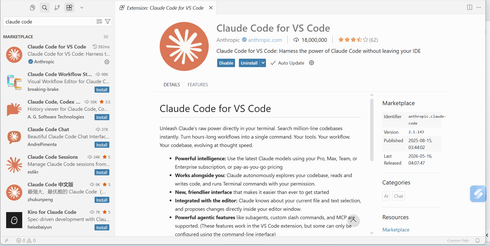
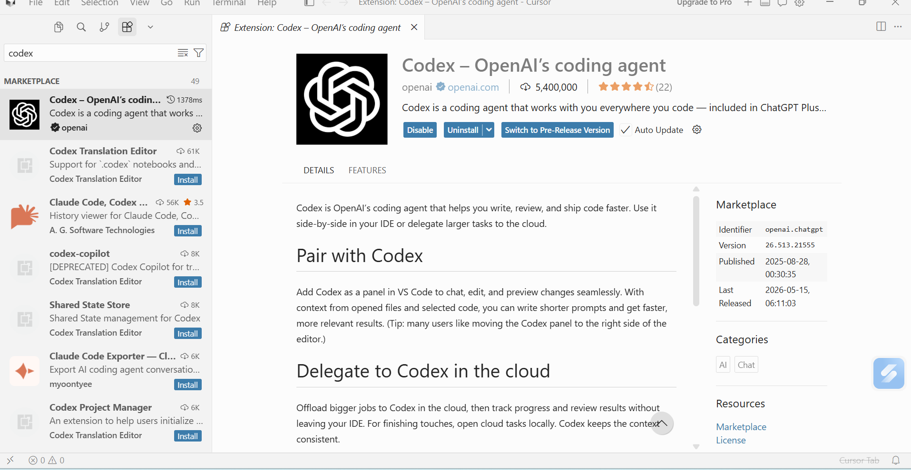
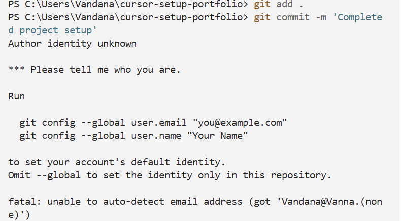

# cursor-setup-portfolio
Portfolio setup project using Cursor IDE, Claude Code, and Codex

## Tools installed
- Cursor IDE
- Claude Code Extension
- Codex Extension
- GitHub

## Steps Completed
1. Installed Cursor IDE
2. Installed Claude Code extension

3. Installed Codex extension

4. Created GitHub repository
5. Opened repository in Cursor
6. Edited README.md
7. Committed and pushed changes

## Issues Faced
- Git commit initially failed because Git could not detect the author identity (user name and email were not configured).

## Solutions
- Configured Git identity using the following commands:

git config --global user.name "Vandana Sonal"

git config --global user.email "vandanasonal12392@gmail.com"

- Retried the commit after configuration, and it worked successfully.

## Final Status
- Project setup completed successfully.